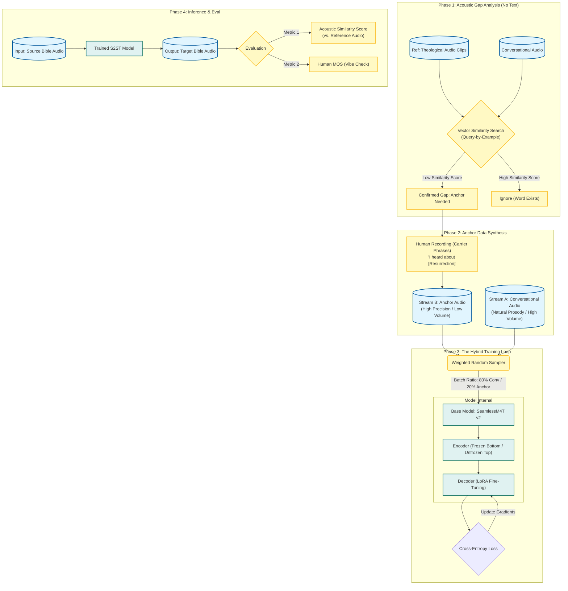

# RFC 001-v4: Low-Resource Oral Bible Translation System Design
## "Keyword Anchor" Domain Adaptation via Weighted S2ST (Audio-Only)

| Metadata | Details |
| :--- | :--- |
| **Status** | Proposed |
| **Target Architecture** | S2ST (Speech-to-Speech Translation) |
| **Base Model** | Meta SeamlessM4T v2 (Large) |
| **Methodology** | PEFT (LoRA) + Weighted Keyword Injection |

---

## 1. Executive Summary

This document specifies the architecture for a Domain-Adaptive S2ST system. The system translates Biblical **source audio** directly into low-resource **target audio** by leveraging **Conversational Data** for prosody and a synthetic **Anchor Dataset** for theological precision.

The critical innovation is the **Hybrid Sampling Strategy**, which decouples the learning of *acoustic syntax* (from conversation) and *lexical semantics* (from anchors). We utilize a **Text-Free Gap Analysis** pipeline (Query-by-Example) to identify missing vocabulary without relying on ASR or transcripts.

---

## 2. System Architecture Diagram

This diagram illustrates the **Pure Audio** lifecycle. Note that Phase 1 uses **Acoustic Matching** (Vector Similarity) instead of Transcripts.

---

## 3. Data Engineering Pipeline

### 3.1. Dataset Composition
The model training relies on two distinct data streams that are merged at runtime.

| Stream | Source | Characteristics | Volume (Est.) | Role |
| :--- | :--- | :--- | :--- | :--- |
| **A (Primary)** | Real-world Recordings | Spontaneous, fast, slang-heavy, variable noise floor. | 10-50 Hours | Teaches **Prosody, Phonotactics, & Syntax**. |
| **B (Anchor)** | Elicited Recordings | Scripted, clear, slow, high-fidelity. | 10-30 Minutes | Teaches **Theological Vocabulary & Acoustic Units**. |

### 3.2. The "Anchor" Generation Protocol (Acoustic Only)
To identify which "Anchors" are needed without text, we use Keyword Spotting.

**Reference Bank:** A native speaker records isolated keywords (e.g., "Baptism", "Grace").

**Scanning:** We encode these clips into the embedding space (using the Frozen Encoder of SeamlessM4T).

**Search:** We scan the Conversational Dataset. If the Cosine Similarity between the Reference Keyword and the Conversation never exceeds a threshold (e.g., 0.7), we mark that term as Missing.

**Construction:**
Once a gap is confirmed, we record the term in Carrier Phrases:
- **Template:** [Context Audio] + [Keyword Audio] + [Context Audio]
- **Example:** "My friend said... resurrection ...to me."

**Rationale:** This ensures we are solving a real acoustic deficit. If the model has heard "Baptism" 100 times in the conversation (maybe it's a common word in that culture), we don't need to inject it. We only inject what is acoustically absent.

### 3.3. Pre-processing Workflow
All audio inputs must pass through a normalization chain:

VAD $\rightarrow$ Trim Silence $\rightarrow$ Loudness Norm (-23 LUFS) $\rightarrow$ Resample (16kHz) $\rightarrow$ Unit Extraction.

---

## 4. Model Architecture & Fine-Tuning Strategy

### 4.1. Backbone Configuration
We utilize Meta SeamlessM4T v2 (Large).

**Encoder:** Conformer-based.
- **Action:** Freeze the bottom 18 layers. Unfreeze the top 6 layers (Adapter).

**Decoder:** Transformer Decoder predicting discrete units.
- **Action:** Full Fine-tuning or LoRA (Low-Rank Adaptation).

**Rationale (Why Seamless vs. MMS):** MMS is primarily a self-supervised Encoder. SeamlessM4T is an Encoder-Decoder natively trained on alignment. Using MMS would require us to build and initialize a fresh Decoder from scratch.

### 4.2. PEFT (Parameter-Efficient Fine-Tuning)
To avoid "Catastrophic Forgetting" of the pre-trained multilingual capabilities, we use LoRA.

- **Target Modules:** `q_proj`, `v_proj`, `o_proj` in the Attention layers.
- **Rank ($r$):** 64.
- **Alpha ($\alpha$):** 128.
- **Dropout:** 0.1.

**Rationale (Why LoRA):** Full fine-tuning updates all 1B+ parameters, which often leads to overfitting on small datasets. LoRA freezes the main weights and only updates a small adapter.

### 4.3. The Weighted Sampling Logic
We do not trust the natural distribution of data.

Let $N_{conv} = 10,000$ and $N_{anchor} = 100$.

We define a target ratio $\lambda = 0.2$ (20% of batch must be anchors). The sample weight $w_i$ is:

$$w_i = \begin{cases} 
\frac{1}{N_{conv}} \times (1 - \lambda) & \text{if } i \in D_{conv} \\
\frac{1}{N_{anchor}} \times \lambda & \text{if } i \in D_{anchor} 
\end{cases}$$

**Rationale:** By artificially oversampling the Anchors, we ensure the gradient magnitude for theological terms is large enough to shift the model weights, forcing the model to "memorize" these specific acoustic patterns.

---

## 5. Inference & Decoding Strategy
To maximize the "Oral" feel, we adjust the decoding search.

### 5.1. The "Anti-Robot" Configuration
**Strategy:** Nucleus Sampling (Top-p).

**Configuration:**
- `do_sample = True`
- `top_p = 0.90` (Cut off the tail of low-probability nonsense).
- `temperature = 0.8` (Favor precision but keep prosody).
- `repetition_penalty = 1.2` (Aggressive penalty to stop S2ST loops).

**Rationale (Why not Beam Search):** Beam Search always picks the "most probable" (safest/blandest) path. Nucleus Sampling allows the model to occasionally pick the 2nd or 3rd best option, which restores the "color" of natural human speech.

---

## 6. Evaluation & Acceptance Criteria (Audio Only)

### 6.1. Automated Metrics (Acoustic Matching)
Since we cannot use ASR, we use Embedding Distance.

**Metric: LASER/Sonar Similarity**
1. **Generate:** Model produces Output Audio for "Resurrection".
2. **Encode:** Pass Output Audio into a multilingual encoder (like Sonar) to get vector $V_{out}$.
3. **Reference:** Pass the "Anchor" recording of "Resurrection" into the same encoder to get vector $V_{ref}$.
4. **Score:** $CosineSimilarity(V_{out}, V_{ref})$.

**Rationale:** High cosine similarity means the model generated audio that "means" the same thing as the reference anchor, even if the waveform is different.

### 6.2. Human Evaluation (The "Vibe Check")
**MOS (Mean Opinion Score):**
- **Naturalness (1-5):** "Does this sound like a neighbor talking?"
- **Reverence (1-5):** "Is this acceptable for scripture?"

---

## 7. Future Work: Alignment via RLHF (DPO)

While the current proposal ensures accuracy via Supervised Fine-Tuning (SFT), it does not explicitly optimize for "Reverence" or "Quality".

**Problem:** The model might produce "slang" versions of verses that are accurate but culturally inappropriate.

**Solution:** Implement Direct Preference Optimization (DPO).

1. Generate pairs of audio: $(y_{winner}, y_{loser})$.
2. Have humans vote on which version sounds more "respectful".
3. This aligns the model's style without needing new training data, effectively filtering out the "too casual" patterns from the conversational dataset.

---

## 8. References & Further Reading

**1. The Base Model (SeamlessM4T)**
- Barrault et al. (2023). "SeamlessM4T: Massively Multilingual & Multimodal Machine Translation."
- **Why read:** Explains the UnitY architecture and why S2ST is better than cascaded systems.
- [arXiv:2308.11596](https://arxiv.org/abs/2308.11596)

**2. Acoustic Word Embeddings (Gap Analysis Method)**
- Kamper et al. (2016). "Deep convolutional acoustic word embeddings using word-pair side information."
- **Why read:** Explains how to match words in audio without text (Query-by-Example).
- [arXiv:1602.02526](https://arxiv.org/abs/1602.02526)

**3. The Fine-Tuning Method (LoRA)**
- Hu et al. (2021). "LoRA: Low-Rank Adaptation of Large Language Models."
- **Why read:** Justifies why we are not retraining the whole model (Efficiency & Stability).
- [arXiv:2106.09685](https://arxiv.org/abs/2106.09685)

**4. Discrete Audio Units (HuBERT/EnCodec)**
- Hsu et al. (2021). "HuBERT: Self-Supervised Speech Representation Learning by Masked Prediction of Hidden Units."
- **Why read:** Understand why we predict discrete tokens (like [45, 112]) instead of continuous waveforms.
- [arXiv:2106.07447](https://arxiv.org/abs/2106.07447)

**5. S2ST & Voice Preservation (Translatotron 2)**
- Jia et al. (2022). "Translatotron 2: High-quality direct speech-to-speech translation with voice preservation."
- **Why read:** The evolution of S2ST and techniques for retaining the speaker's original voice characteristics.
- [arXiv:2107.08661](https://arxiv.org/abs/2107.08661)

**6. Multilingual Sentence Embeddings (SONAR)**
- Duquenne et al. (2023). "SONAR: Sentence-Level Multimodal and Language-Agnostic Representations."
- **Why read:** The theoretical basis for our "Acoustic Similarity" evaluation metric.
- [arXiv:2308.11466](https://arxiv.org/abs/2308.11466)

**7. Decoding Strategy (Nucleus Sampling)**
- Holtzman et al. (2020). "The Curious Case of Neural Text Degeneration."
- **Why read:** The original paper proposing Top-p (Nucleus) sampling to fix repetitive "robotic" generation.
- [arXiv:1904.09751](https://arxiv.org/abs/1904.09751)

**8. Alignment for Generative Models (DPO)**
- Rafailov et al. (2023). "Direct Preference Optimization: Your Language Model is Secretly a Reward Model."
- **Why read:** The mathematical foundation for the proposed "Future Work" on alignment.
- [arXiv:2305.18290](https://arxiv.org/abs/2305.18290)

**9. Self-Supervised Speech Encoders (Wav2Vec 2.0)**
- Baevski et al. (2020). "wav2vec 2.0: A Framework for Self-Supervised Learning of Speech Representations."
- **Why read:** The precursor to HuBERT/Seamless encoders, essential for understanding contrastive learning in speech.
- [arXiv:2006.11477](https://arxiv.org/abs/2006.11477)