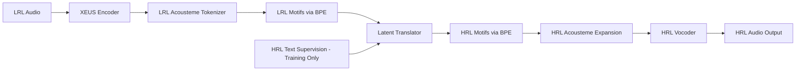
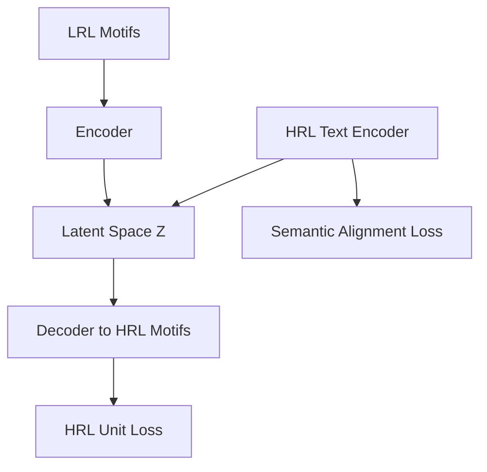

# RFC 011: Oral-First Acousteme Translation Reframe (Fix Proposal for RFC 010)

- Feature Name: `oral_first_acousteme_translation_reframe`
- Start Date: 2026-02-24
- Related: RFC 010 (Parallel Acousteme-to-Acousteme Translation), RFC 009 (XEUS vs MMS), RFC 008 (Semantic-Acoustic Linking)
- Status: Proposed

# Summary

This RFC corrects the central framing in RFC 010.

RFC 010 interpreted "text-free" symmetrically and prohibited text supervision on both sides. That created a harder problem than the one we need to validate.

This RFC reframes the constraint to match the real hypothesis:

- **Low-resource oral language (LRL) side must remain text-free at training and inference.**
- **High-resource bridge language (HRL) side may use text during training for semantic grounding.**

The goal is not to prove universal text-free MT.  
The goal is to prove that a language without an alphabet can access translation infrastructure through acoustemes.

# Motivation

Bible translation workflows usually assume writing systems, transcripts, and text-aligned resources. Many oral communities do not have these prerequisites.

Hypothesis:

- Acoustemes can function as a computational writing substrate for oral languages.
- If the LRL remains fully text-free while the HRL contributes text supervision during training, we can build practical translation paths without excluding oral languages.

This is a better test of the real product and mission claim than symmetric text prohibition.

# Problem Statement

## Where RFC 010 Drifted

RFC 010 treated "no text" as a global rule:

- no source text
- no target text
- no text supervision at all

That drifted from the core hypothesis:

- the missing writing system problem is on the **LRL side**, not necessarily on HRL.

Resulting issue:

- experiment difficulty increased substantially
- semantic grounding was weakened
- failure would be less interpretable relative to the mission hypothesis

## Corrected Constraint

Replace:

- "No text on either side, at training or inference."

With:

- "No text required on the low-resource language side, at training or inference."
- "The high-resource bridge language may use text supervision during training only."
- "Inference from LRL remains fully text-free."

# Guide-Level Explanation

## Revised Pipeline

At training:

- LRL audio -> LRL acoustemes (no text)
- HRL audio + HRL text -> semantically grounded latent space
- Translator learns LRL acoustemes -> HRL acoustemes with latent semantic anchoring

At inference:

- LRL audio -> LRL acoustemes -> latent -> HRL acoustemes -> HRL audio
- No LRL text, no LRL ASR, no LRL MT text component

## Why This Is Aligned

- Keeps the oral-language side fully independent of writing systems
- Uses available HRL text where it actually exists
- Improves semantic identifiability and sample efficiency
- Produces a clearer go/no-go signal for oral-language enablement

# Reference-Level Explanation

## Architecture (Reframed)

## Supervision Contract

### LRL Side (Hard Constraint)

- No transcripts
- No ASR pseudo-text
- No text MT supervision
- No text in inference path

### HRL Side (Allowed During Training)

- Text transcripts allowed
- Semantic supervision allowed
- Alignment losses to anchor latent semantics allowed

### Inference Contract

- Input is LRL audio
- Output is HRL audio
- No LRL text dependency

## Objective Function (Revised)

Base:

- `L_unit`: HRL motif/unit prediction loss

Auxiliary:

- `L_align_audio`: monotonic/soft alignment for audio-unit timing
- `L_duration`: insertion/deletion control
- `L_semantic_text`: latent alignment to HRL text semantics (train only)
- `L_contrastive`: paired latent consistency

Suggested first weighting:

- `L = L_unit + 0.4*L_align_audio + 0.3*L_duration + 0.4*L_semantic_text + 0.2*L_contrastive`

Notes:

- `L_semantic_text` is the key correction term in this RFC.
- No loss ever requires LRL text.

# Data and Training Design

## Data Contract

- LRL audio segments with stable IDs
- HRL audio segments aligned by IDs
- HRL text for aligned segments (where available)
- Pair metadata and quality tags

## Keep from RFC 010

Retain the engineering assets already defined:

- XEUS backbone
- BPE motifs over acoustemes
- Pair-quality filters (duration ratio, similarity thresholds)
- Duration modeling
- Retrieval baseline checks
- Existing vocoder integration

## What Changes from RFC 010

- Remove symmetric prohibition on HRL text supervision
- Add explicit HRL text latent anchoring objective
- Update success criteria to mission-aligned outcomes

# Success Criteria (Revised)

Primary success:

- A language with no writing system on the LRL side can produce semantically valid HRL speech from LRL audio input.

Evaluation must include:

1. **Semantic preservation** (human judgment, domain-aware rubric)
2. **Theological meaning fidelity** on curated keyword/event set
3. **Improvement over retrieval baseline**
4. **Text-free LRL compliance** (no LRL text artifacts in train/infer)

Secondary:

- Naturalness and intelligibility of HRL audio output
- Robustness across speakers and recording conditions

# Rationale

This revision increases validity, not compromise.

- It directly tests oral-language inclusion.
- It avoids a harder symmetric text-free research problem that is orthogonal to mission.
- It uses known, defensible supervision on the side that already has writing resources.
- It keeps the claim strict where it matters: the LRL pipeline remains text-free.

# Risks and Mitigations

| Risk | Impact | Mitigation |
| --- | --- | --- |
| HRL text dominates latent space | Overfit to HRL lexical priors | Keep audio-conditioned losses primary, schedule semantic loss weight |
| Weak pair alignment | Semantic drift | Preserve RFC 010 quality filters and monotonic constraints |
| False confidence from fluent output | Wrong meaning with good prosody | Emphasize semantic rubric and theological event checks |
| Scope creep into full text MT | Hypothesis dilution | Enforce LRL-side no-text gate in code and eval |

# Implementation Guidance

1. Keep current XEUS + BPE + seq2seq backbone from RFC 010.
2. Add HRL text encoder branch only for training.
3. Add latent semantic alignment loss against HRL text embeddings.
4. Preserve LRL text-free constraints in data loaders and inference APIs.
5. Report both:
   - mission metric (oral-language enablement)
   - technical metric (translation quality over baseline)

# Training Differences vs RFC 010 (Data-Agnostic)

These differences apply regardless of which paired corpus is used.

1. **Constraint scope changes**
   - RFC 010: text-free on both sides.
   - RFC 011: text-free is mandatory only on the LRL side; HRL text is allowed in training.

2. **Supervision topology changes**
   - RFC 010: audio/acousteme supervision only.
   - RFC 011: adds HRL text-semantic supervision to anchor latent representations.

3. **Model graph changes**
   - RFC 010: acousteme/motif translator only.
   - RFC 011: adds an HRL text encoder branch connected to the latent space during training.

4. **Loss design changes**
   - RFC 010: `L_unit + L_align + L_contrastive + L_duration`.
   - RFC 011: keeps those terms and adds `L_semantic_text` as a primary correction term.

5. **Training schedule changes**
   - RFC 011 should train with audio-unit objectives as the base and progressively enable semantic-text anchoring to avoid HRL text dominance.

6. **Inference contract remains strict**
   - RFC 011 inference still runs without LRL text: `LRL audio -> HRL audio`.
   - HRL text branch is train-time only.

# Decision Gate

Continue investment only if:

- LRL text-free inference produces HRL audio judged semantically better than baseline
- theological meaning transfer is consistently preserved in held-out samples

Stop or redesign if:

- improvements are mostly acoustic naturalness without meaning gains
- model relies on artifacts violating LRL no-text constraint

# References

1. [RFC 010: Parallel Acousteme-to-Acousteme Translation](./010-parallel-acousteme-latent-translation.md)
2. [RFC 009: XEUS vs MMS Foundation Model Analysis](./009-xeus-vs-mms-foundation-model-analysis.md)
3. [RFC 008: Semantic-Acoustic Linking](./008-semantic-acoustic-linking.md)
4. [Salesky et al. (2020), MaSS](https://aclanthology.org/2020.lrec-1.799/)
5. [Chen et al. (2024), XEUS](https://aclanthology.org/2024.emnlp-main.570/)
