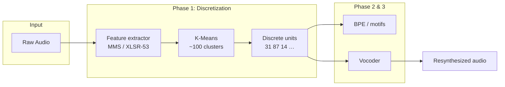
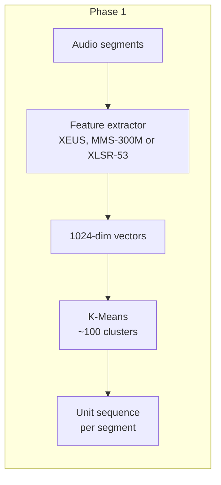
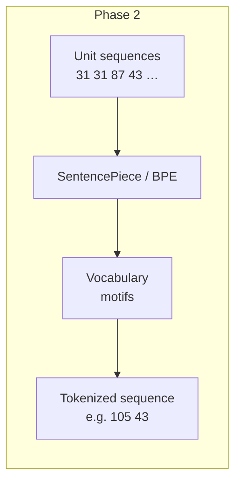
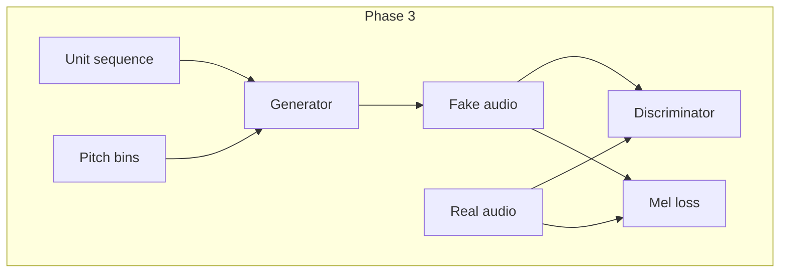
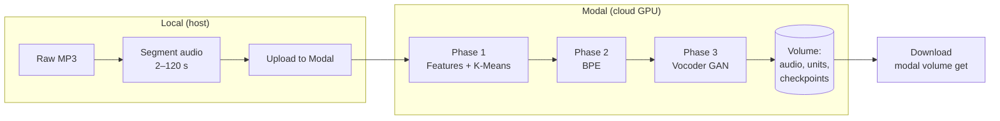
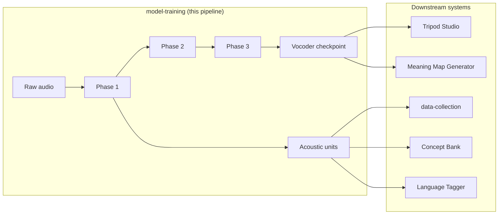

# Proprietary ML Models

## What it is and why it exists

**Proprietary ML Models** is the family of **speech-related machine learning models** that Shema trains and uses for oral Scripture workflows. Unlike off-the-shelf ASR or generic speech synthesis, these models are built to work from **audio alone** (no transcripts) and to support **low-resource languages** — e.g. Sateré-Mawé — where written corpora and commercial tools are scarce. The main pipeline turns raw Bible audio into **discrete acoustic tokens** (a learned “vocabulary” of ~100 speech sounds) and trains a **vocoder** that turns those tokens back into natural speech. That enables **speech-to-speech translation**, **voice preservation**, and **audio Bible generation** from unit sequences (e.g. produced by translation or meaning-map pipelines). In the system landscape, this capability is **shared**: it feeds the Language Archive (data-collection), Concept Bank, Tripod Studio, and Meaning Map Generator. **This capability is still in development;** the implementation lives in the [model-training](https://github.com/shemaobt/model-training) repository.

**In one sentence:** It is the pipeline that learns acoustic units from speech and trains a vocoder (units → audio) for low-resource languages, so other Shema systems can use consistent, trainable speech representations.

### Pipeline at a glance

---

## Key terms (defined)

- **Acoustic units (tokens)** — Discrete symbols (e.g. 31, 87, 14…) that represent short stretches of speech. Learned in **Phase 1** by clustering self-supervised features (e.g. MMS-300M or XLSR-53); no text or transcripts required. ~100 units per language.
- **Vocoder** — A neural network that converts a **sequence of acoustic units** (and optional pitch) into a **waveform** (16 kHz WAV). Trained in **Phase 3** (GAN: Generator + Discriminator). The trained model is used for resynthesis (units → audio) in translation and audio-generation pipelines.
- **Phase 1 / Phase 2 / Phase 3** — The three training phases in order: (1) acoustic tokenization (features + K-Means → units), (2) BPE/motif discovery on unit sequences (optional, for analysis), (3) vocoder training (units → audio). Phases 1 and 2 must complete before Phase 3.
- **Low-resource language** — A language with little or no written corpus or commercial speech tools (e.g. Sateré-Mawé). The pipeline is designed to work from audio only, making it suitable for such languages.
- **Self-supervised learning** — Learning representations from raw audio without human labels; the feature extractor (1 - XEUS, 2 - MMS or 3 - XLSR-53) was pre-trained this way; we add clustering and vocoder training on top.

---

## Purpose

- **Solves:** The need for **language-specific, trainable speech models** that do not depend on transcripts and that support low-resource languages (oral Scripture, voice preservation, speech-to-speech translation).
- **Target users:** Teams building oral Bible products, translation pipelines for languages like Sateré-Mawé; downstream systems (data-collection, Tripod Studio, meaning-map-generator) that consume acoustic units or synthesized audio.
- **Primary outcomes:** Per-language acoustic unit vocabulary, trained vocoder checkpoints (units → natural speech), optional BPE/motif analysis; all produced by a reproducible, cloud-based pipeline. **Status: in development.**

---

## Core capabilities

1. **Acoustic tokenization (Phase 1)**  
   Extract features from speech (MMS-300M or XLSR-53), cluster them with K-Means (~100 clusters), and assign each frame to a discrete unit. Outputs: `kmeans.pkl`, unit sequences, timestamped corpus. No transcripts needed; suitable for low-resource languages.

2. **Pattern discovery (Phase 2)**  
   Run BPE (e.g. SentencePiece) on unit sequences to find recurring “motifs” (acoustic “words”). Optional; used for linguistic analysis and pattern discovery. Outputs: BPE vocabulary and tokenized sequences.

3. **Vocoder training (Phase 3)**  
   Train a GAN: **Generator** (units + optional pitch → waveform), **Discriminator** (real vs. fake). V1: simpler, flatter prosody; **V2** (recommended): HiFi-GAN + pitch conditioning for natural prosody. Outputs: checkpoint files (e.g. `v2_best.pt`) that downstream systems load for synthesis.

4. **Synthesis (inference)**  
   Given a sequence of acoustic units (and optional pitch), the trained vocoder produces 16 kHz mono WAV. Used in speech-to-speech translation, audio Bible generation, and resynthesis from unit sequences (e.g. from translation or meaning-map pipelines).

### Phase 1: Acoustic tokenization

### Phase 2: Pattern discovery (BPE)

### Phase 3: Vocoder (GAN)

---

## Training and inference architecture

### End-to-end data flow

- **Data flow:** Raw MP3 → local segmentation (silence-based, 2–120 s segments) → upload to Modal volume → Phase 1 (features + K-Means) → Phase 2 (BPE) → Phase 3 (vocoder GAN) → checkpoints and test outputs on Modal volume; download via `modal volume get`.
- **Model lifecycle:** Phase 1 and 2 produce artifacts (K-Means, corpus, BPE); Phase 3 trains the vocoder with checkpointing and resume. Per-language config (`LANGUAGE_CONFIGS`) separates Portuguese, Sateré-Mawé, and any added languages.
- **Serving path:** Trained vocoder checkpoints are downloaded and loaded by inference code (e.g. in translation or resynthesis pipelines). There is no live “model server” in the repo; serving is left to consuming systems. Quality is evaluated with test scripts (MCD, SNR, F0 RMSE).

---

## Runtime and deployment

- **Environments:** **Training** runs on **Modal** (cloud GPUs); **local scripts** (segment audio, upload) run on the host. No training on the host.
- **Build/deploy path:** No traditional “build”; Python with dependencies defined inside Modal image. Run: `python3 -m modal run src/training/phase1_acoustic.py` (and similarly for phase2, phase3, full pipeline). Use `--detach` for long jobs. Download results with `modal volume get bible-audio-data <remote_path> <local_path>`.
- **Operational dependencies:** Modal account and token; `ffmpeg` (local); sufficient Modal volume space for segmented audio, units, and checkpoints. Dependencies (PyTorch, transformers, librosa, etc.) are pinned in the Modal image.

---

## Integrations

- **Producers:** Raw Bible audio (MP3), segmented and uploaded per language. No direct producers in the landscape; data is prepared manually or by upstream collection.
- **Consumers:** Language Archive (data-collection), Concept Bank, Tripod Studio, Meaning Map Generator (per system landscape). They consume acoustic units, vocoder checkpoints, or synthesized audio. Exact contracts (file formats, APIs) are still evolving; the pipeline is in development.
- **Contracts:** Phase outputs (K-Means, corpus JSON, BPE, `.pt` checkpoints) are on the Modal volume; consuming systems must know paths and formats. Standard output is 16 kHz mono WAV from the vocoder.

### How consumers use the models

---

## Related software

- **model-training** — The implementation repository: [shemaobt/model-training](https://github.com/shemaobt/model-training). Contains Phase 1–3 scripts, V1/V2 vocoder code, segment/upload scripts, and docs (e.g. VOCODER_V2_ARCHITECTURE.md, MMS_VS_XLSR53.md). **This capability is in development;** the repo is the source of truth for pipeline and model details.

---

## Related RFCs

- [Semantic Acoustic Mapping](/rfcs/semantic-acoustic-mapping), [Semantic Acoustic Linking](/rfcs/semantic-acoustic-linking) — semantic representation and linking.
- [Parallel Acousteme Latent Translation](/rfcs/parallel-acousteme-latent-translation), [Oral-First Translation Reframe](/rfcs/oral-first-acousteme-translation-reframe) — translation direction and oral-first flow; relevant to how units and vocoders are used in translation pipelines.
- [XEUS / Feature extractor comparison](/rfcs/xeus-vs-mms-foundation-model-analysis) — choice of self-supervised feature extractor for Phase 1 (XEUS vs MMS-300M vs XLSR-53); trade-offs for low-resource languages and pipeline compatibility.

---

## Roadmap and open questions

- **Near-term:** Stabilize V2 vocoder quality and multi-language support; document inference/serving patterns for consuming systems; consider AudioLM-style or further MMS integration (see model-training docs).
- **Risks:** Training time and cost on Modal; dependency on audio quality and segmentation.
- **Decisions pending:** Canonical serving interface (API vs. file-based); versioning and distribution of checkpoints; how data-collection, Tripod Studio, and meaning-map-generator will call these models in production.
