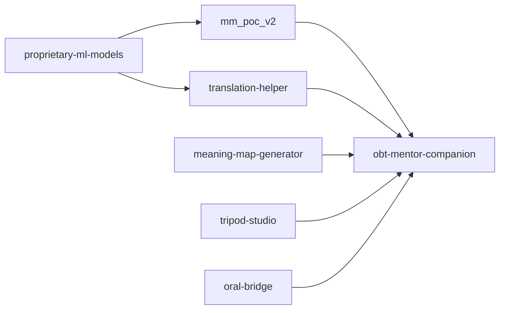

# System Landscape

This page describes how current Shema systems fit together and where to document details.

## Portfolio map

## System documentation checklist

Every system page should include:

- purpose and scope,
- main user flows,
- architecture and components,
- runtime/deployment model,
- data contracts and dependencies,
- known risks and next milestones.

## Ownership model

Use one page per system in `Systems`. Keep this architecture page focused on cross-system relationships.
