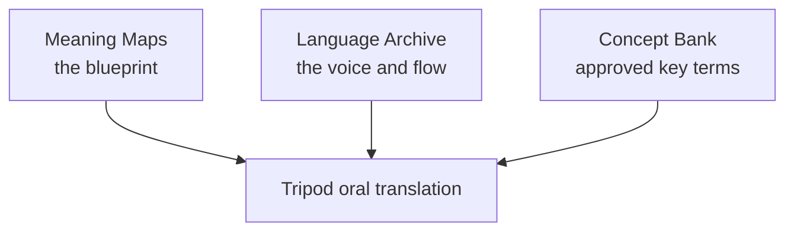
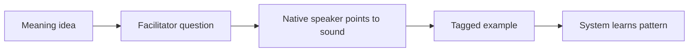
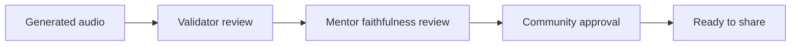

# Tripod Overview

## Purpose

The Tripod Oral Method is a way to help communities receive Scripture in the way they naturally communicate: spoken language. It is built for places where written materials are limited, where literacy levels vary, or where people learn best by listening and repeating.

Instead of treating written text as the center of everything, Tripod starts from meaning, learns from real community speech, and produces spoken drafts that can be reviewed by local speakers and mentors.

This page explains the method in plain language, with enough detail for first-time readers.

## The core problem: translationese

Traditional translation often follows the structure of the source language too closely. The result can be accurate on paper but awkward when spoken. People sometimes call this **translationese**: a translation that sounds foreign, stiff, or unnatural.

For oral communities, Scripture should sound like a trusted storyteller from the community, not like a foreign sentence read aloud. Tripod is designed around that goal.

## What success looks like

Tripod is considered successful when the spoken result is:

- **Faithful**: it keeps the original meaning and does not add or remove key ideas.
- **Natural**: it sounds like normal speech from that community.
- **Clear**: listeners understand without needing extra explanation.
- **Consistent**: important biblical ideas are expressed with stable, approved terms.
- **Usable**: recordings are ready to share through community listening channels.

## The three pillars (the "Tripod")

Tripod stands on three knowledge pillars.

### Pillar 1: Meaning Maps (the blueprint)

A Meaning Map is a language-neutral map of a passage:

- who is involved,
- what happens,
- what emotions are present,
- what social dynamics are important.

It does not try to keep the grammar of the source language. It keeps the meaning and intent.

Think of it like an architect's sketch: it is not the final building, but it protects structure so construction stays true to the design.

### Pillar 2: Language Archive (the voice and flow)

The Language Archive is a large collection of natural local speech (stories, conversations, everyday explanations). The system learns how the community naturally speaks and tells stories.

This is important because naturalness cannot be invented in an office. It must come from real local voices, real rhythm, real storytelling habits, and real social tone.

### Pillar 3: Concept Bank (approved vocabulary)

Some biblical terms need extra care. The Concept Bank keeps community-approved ways to express important concepts (for example grace, covenant, temple) so these meanings stay clear and consistent.

Without this pillar, different drafts can drift and confuse listeners. With it, high-impact terms stay stable across passages.

## Teaching the bridge between meaning and sound

Tripod must connect abstract meaning directly to real speech patterns.

### AViTA (Aural-Visual Tagging App)

AViTA helps a facilitator and a native speaker work together. The facilitator asks plain-language questions, and the speaker identifies the matching sound in real audio. This teaches the system how meaning is expressed in that language's natural speech.

### Smart sampling (Pareto active learning)

Instead of labeling everything, the team focuses on the most informative examples first. By reviewing a smaller strategic set, the system can learn much faster while still improving quality.

In practice, this means teams spend time on the examples that teach the biggest lessons first, rather than trying to review every minute of audio in the same way.

## Who does what

Tripod is not "fully automatic." Different people carry different responsibilities:

- **Facilitator**: guides sessions, asks clear questions, and organizes reviews.
- **Native speaker validator**: checks naturalness, tone, and local acceptability.
- **Mentor**: checks faithfulness to meaning and theological safety.
- **Community listeners**: confirm that the final result is understandable and culturally appropriate.
- **Translation team**: manages term decisions, quality records, and release readiness.

## How a new translation is created

When translating a new passage, Tripod behaves more like a composer than a word-for-word converter.

In simple terms, it combines:

1. the intended meaning,
2. the approved key terms,
3. the natural local storytelling style.

The output is new spoken audio designed to sound native and faithful.

## Typical workflow from start to finish

1. **Prepare the passage meaning**
 - The team creates or reviews the Meaning Map for the selected passage.
2. **Check key terms**
 - The team confirms how sensitive terms should be said in this context.
3. **Create a first spoken draft**
 - A draft is generated using local speech patterns learned from the archive.
4. **Validator review**
 - A native speaker marks places that sound unnatural, unclear, or socially off-tone.
5. **Mentor review**
 - A mentor checks whether meaning is preserved, especially in doctrinally sensitive content.
6. **Revise and repeat**
 - The draft is adjusted and reviewed again until both naturalness and faithfulness are strong.
7. **Community readiness check**
 - The team decides if the recording is suitable for broader listening use.

## Community validation (final authority)

AI can help draft, but people make the final decision.

### Validator

A native speaker checks if the audio sounds natural and clear. If needed, they give voice feedback for corrections.

### Mentor

A translation mentor checks if the spoken draft stays faithful to the Meaning Map and does not lose or add theological meaning.

### Community

The community gives final approval for appropriateness and readiness to share.

## Why this approach matters for oral-first ministry

- It respects how people actually learn and pass on knowledge.
- It reduces dependence on written intermediate drafts.
- It protects meaning while honoring local expression.
- It scales support for languages that have fewer formal translation resources.
- It keeps human discernment in the final gate, where it belongs.

## Boundaries and cautions

Tripod is powerful, but it still requires discipline:

- A draft that sounds fluent is not automatically faithful.
- Key term decisions must be maintained and reviewed over time.
- Community approval is essential before broad distribution.
- Quality depends on strong local participation, not only tooling.

## Summary

Tripod helps oral communities receive Scripture in a way that sounds natural, culturally grounded, and faithful to meaning. It protects local storytelling style while keeping key biblical concepts accurate.

## Related reading

- [Tripod (Tech Overview)](/docs/architecture/tripod-tech-overview)
- [System Landscape](/docs/architecture/system-landscape)

