# Tripod Overview

## Purpose

The Tripod Oral workflow is a **Conditionally Generated Spoken Language Model (CG-SLM)** pipeline designed for **zero-resource languages**. Its core innovation is a direct **Semantic-Acoustic Bridge**: instead of using written text and transcription as the central intermediate, the system learns to generate natural target speech directly from semantic meaning.

This page explains the architecture in a beginner-friendly, phase-by-phase format: what each component does, how data moves between components, and where human validation is applied.

## Core flows

- **Flow 1 - Data grounding**: build semantic meaning maps and collect authentic community speech.
- **Flow 2 - Bridge alignment**: convert speech to discrete units and align them to ontology-level meaning tags.
- **Flow 3 - Generative training**: train a Seq2Seq model to map semantic tokens to acoustic motifs.
- **Flow 4 - Production and review**: generate new spoken passages, vocode them to audio, and validate with community and mentor review.

## Architecture

Start with the global map, then read each numbered block.

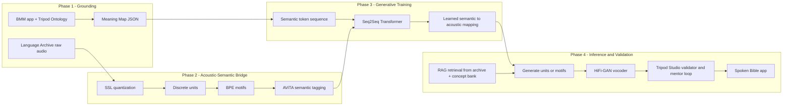

### 1.1 Phase 1 - Data collection and grounding

Phase 1 gathers the two foundational inputs for the whole pipeline:

1. **Pure meaning (semantic grounding)**
2. **Pure sound (acoustic grounding)**

#### Semantic grounding

- **Software/framework**: Biblical Meaning Maps (BMM) app + Tripod Ontology v5.3.
- **How it works**: exegetes and facilitators analyze source biblical text and map it into a language-agnostic, hierarchical Meaning Map JSON.
- **What the ontology captures**:
  - participants (who)
  - events (what action/state)
  - semantic roles (initiator, affected, etc.)
  - pragmatic layers (discourse function, emotion, evidentiality)
  - cross-linguistic patterns (for example causatives and honorifics)

#### Acoustic grounding

- **Input system**: Language Archive.
- **How it works**: collect 100+ hours of natural speech from native speakers (stories, dialogues, procedural speech).
- **Constraint**: no transcription and no translation required for this archive.

Why this phase matters: it establishes an oral-first foundation for languages where text infrastructure is limited or absent.

#### Phase 1 diagram

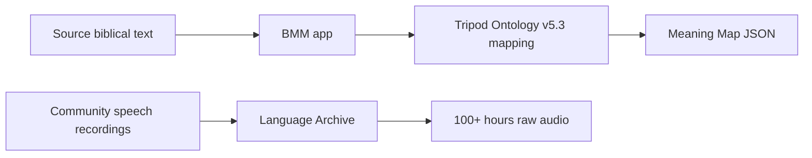

**Reference basis:** [Architecture deep dive](/rfcs/architecture-deep-dive), [Training pipeline](/rfcs/training-pipeline)

### 1.2 Meaning map generation block

This block provides the semantic control structure for generation.

- **Input**: source passage analysis.
- **Output**: Meaning Map JSON with participants, events, discourse, and pragmatic structure.
- **Role in architecture**: this is the semantic contract consumed by the generative model.

#### Meaning map generation diagram

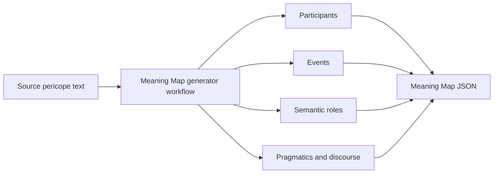

**Reference basis:** [Semantic acoustic mapping](/rfcs/semantic-acoustic-mapping), [Semantic acoustic linking](/rfcs/semantic-acoustic-linking)

### 2.1 Concept bank block

The Concept Bank stores validated semantic anchors used during retrieval and generation.

- **Input**: curated term definitions and approved specialist decisions.
- **Output**: canonical concept list and term-level constraints.
- **Role**: reduce ambiguity for high-stakes terms and keep theological phrasing stable.

#### Concept bank diagram

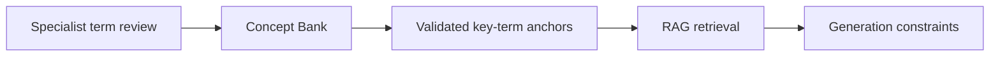

**Reference basis:** [Semantic acoustic linking](/rfcs/semantic-acoustic-linking)

### Phase 2 - Acoustic-Semantic Bridge (alignment)

This phase is the technical substitute for text alignment.

#### Phase 2 diagram

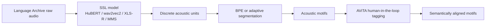

#### Phase 2 data contract diagram

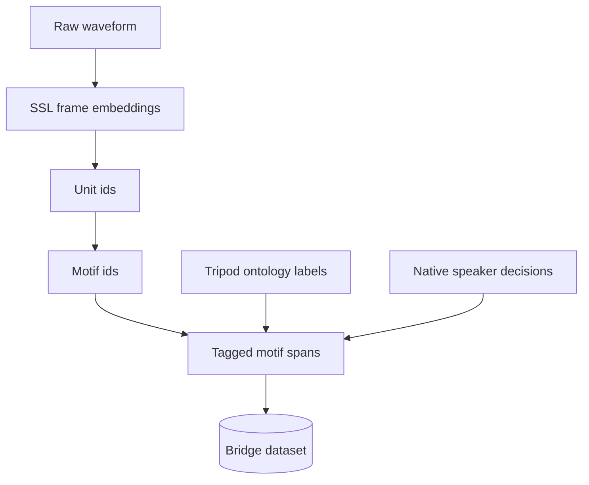

#### Step A: Acoustic quantization (pseudo-text)

- **Models**: self-supervised speech models such as HuBERT, wav2vec 2.0, XLS-R, and MMS.
- **How it works**: raw audio is encoded into sequences of discrete acoustic units.
- **Example output**: `[Unit_45, Unit_102, Unit_88, ...]`
- **Why it exists**: creates a machine-readable speech alphabet without transcripts.

#### Step B: Unsupervised pattern discovery (grammar discovery)

- **Algorithms/tools**: BPE (SentencePiece) or adaptive segmentation.
- **How it works**: recurring unit patterns are merged into **acoustic motifs**.
- **Example motif**: `<45_12>`
- **Why it exists**: motifs behave like morphology-level building blocks before explicit semantic binding.

#### Step C: Dense conversational tagging (targeted supervision)

- **Tool**: AViTA (Aural-Visual Tagging App).
- **How it works**:
  - facilitator asks ontology-aligned plain-language prompts,
  - native speaker isolates the relevant sound span,
  - facilitator tags that motif span with ontology labels (for example evidentiality markers).
- **Efficiency strategy**: Pareto active learning focuses human effort on strategic 5-10 hours instead of labeling the full 100+ hour archive.

Output of phase 2: a practical semantic-acoustic bridge where motifs and ontology categories are linked with human-validated supervision.

**Reference basis:** [Raw acoustemes storage](/rfcs/raw-acoustemes-storage), [Semantic acoustic mapping](/rfcs/semantic-acoustic-mapping), [Semantic acoustic linking](/rfcs/semantic-acoustic-linking)

### Phase 3 - Model training

- **Model family**: Seq2Seq Transformer.
- **Input X**: flattened semantic token sequence from Meaning Map.
  - Example: `[START] [ROLE:initiator] [CONCEPT:David] [ASPECT:perfective] ...`
- **Target Y**: acoustic motif sequence discovered/aligned in phase 2.
- **Learning objective**: learn robust mapping from semantic structure to natural target-language acoustic realization.

What the model learns:

- motif selection under semantic constraints
- oral-language ordering patterns from native data
- pragmatic realization (how aspect, discourse, and role structure influence output)

#### Phase 3 diagram

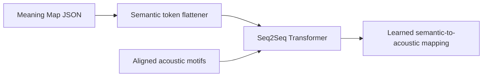

#### Phase 3 training objective diagram

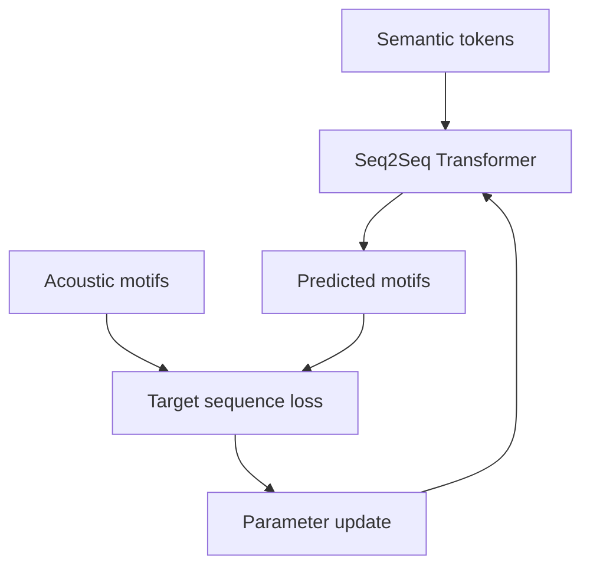

**Reference basis:** [Parallel acousteme latent translation](/rfcs/parallel-acousteme-latent-translation), [Oral-first acousteme translation reframe](/rfcs/oral-first-acousteme-translation-reframe)

### Phase 4 - Inference (generation) and validation

This is the production loop for a new passage.

#### Phase 4 diagram

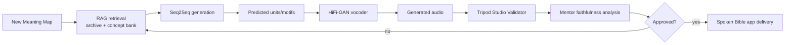

#### Validation state diagram

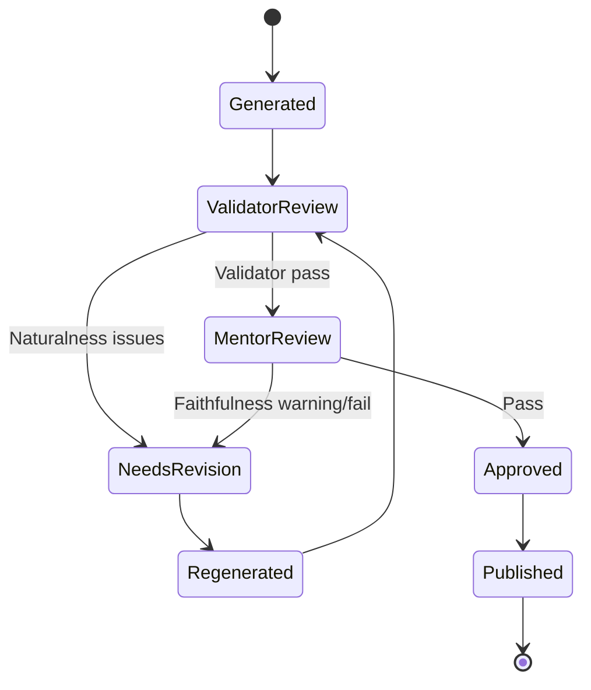

#### Step A: Retrieval-Augmented Generation (RAG)

- **Architecture/tools**: vector database retrieval over Language Archive and Concept Bank.
- **How it works**:
  - retrieve prosodic templates by genre/emotion/context,
  - retrieve validated term anchors for key concepts.
- **Why it exists**: keeps generation natural and culturally grounded while protecting key-term fidelity.

#### Step B: Synthesis (symbolic generation)

- **Model**: Seq2Seq Transformer.
- **How it works**: conditioned by Meaning Map + retrieved guidance, generate final acoustic-unit/motif sequence.

#### Step C: Vocoding (audible realization)

- **Model**: HiFi-GAN vocoder.
- **How it works**: convert predicted symbolic units into high-fidelity waveform audio.
- **Why it exists**: the generator outputs abstract units; HiFi-GAN outputs real speech with natural rhythm and timbre.

#### Step D: Validation and refinement in Tripod Studio

- **Software**: Tripod Studio app.
- **Validator tab**:
  - native speaker checks naturalness and flow,
  - records segment-level feedback when edits are needed.
- **Mentor tab**:
  - after validator pass, mentor runs faithfulness analysis against Meaning Map,
  - traffic-light style result (Pass/Warning/Fail) highlights theological risk.
- **Review loop**: validator and mentor exchange voice feedback until final approval.

**Reference basis:** [AudioLM integration](/rfcs/audiolm-integration), [Parallel acousteme latent translation](/rfcs/parallel-acousteme-latent-translation), [Oral-first acousteme translation reframe](/rfcs/oral-first-acousteme-translation-reframe)

### 3 Delivery layer - spoken Bible app

Approved spoken outputs are packaged and delivered through the Spoken Bible app (mobile-facing experience). This is where the pipeline becomes a community-facing ministry product.

#### Delivery diagram

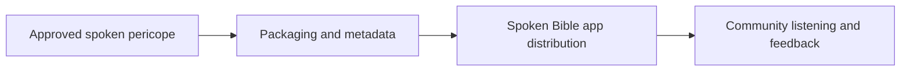

## Runtime and deployment

- **Collection layer**: mobile/web collection workflows and language archive ingestion.
- **Model/training layer**: SSL extraction, motif discovery, seq2seq training, and vocoder training.
- **Inference layer**: retrieval + seq2seq + vocoder generation services.
- **Review layer**: Tripod Studio validator/mentor workflow.
- **Delivery layer**: spoken Bible app distribution.

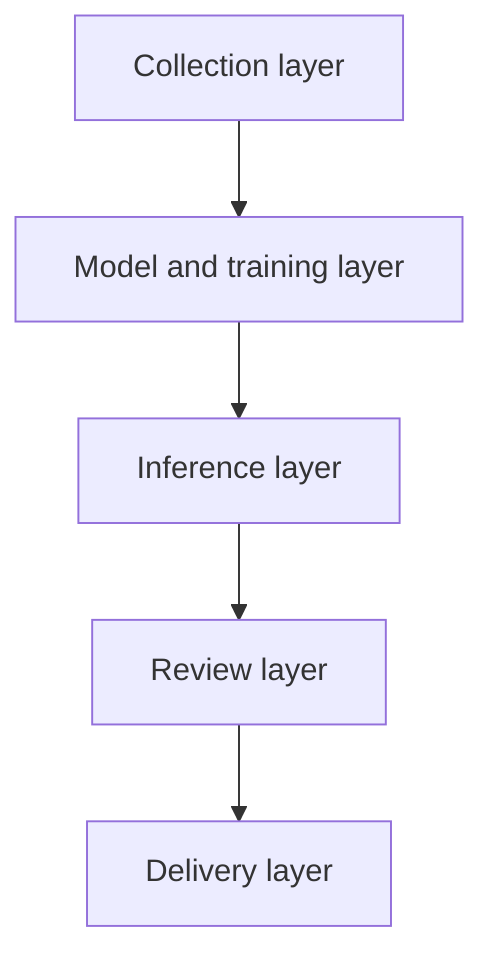

## Integrations

- **Meaning Maps + Tripod Ontology**: semantic source-of-truth contract.
- **Language Archive**: raw speech corpus and retrieval source.
- **AViTA**: motif-level semantic supervision.
- **Concept Bank**: controlled term anchors for key theological vocabulary.
- **Tripod Studio**: human quality gate for naturalness and faithfulness.

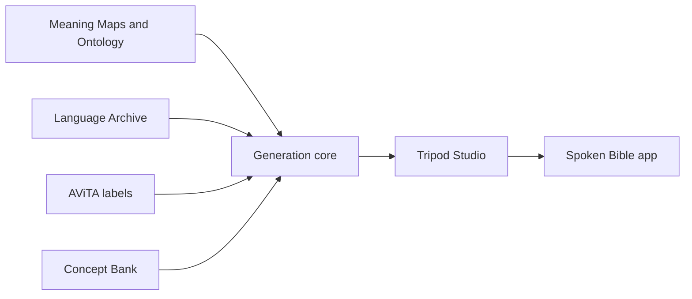

## End-to-end flow

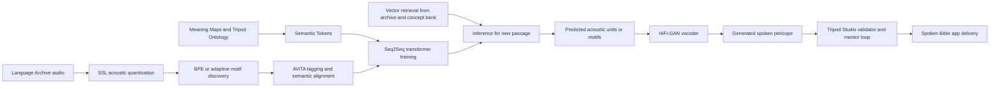

## Related RFCs

- [Speech to speech](/rfcs/speech-to-speech)
- [Architecture deep dive](/rfcs/architecture-deep-dive)
- [Training pipeline](/rfcs/training-pipeline)
- [AudioLM integration](/rfcs/audiolm-integration)
- [Raw acoustemes storage](/rfcs/raw-acoustemes-storage)
- [Semantic acoustic mapping](/rfcs/semantic-acoustic-mapping)
- [Semantic acoustic linking](/rfcs/semantic-acoustic-linking)
- [XEUS vs MMS foundation model analysis](/rfcs/xeus-vs-mms-foundation-model-analysis)
- [Parallel acousteme latent translation](/rfcs/parallel-acousteme-latent-translation)
- [Oral-first acousteme translation reframe](/rfcs/oral-first-acousteme-translation-reframe)

## Roadmap and open questions

- **Near-term milestones**:
  - stabilize ontology-to-motif alignment quality metrics,
  - formalize AViTA tagging protocol and active-learning sample policy,
  - standardize RAG retrieval tags (genre, emotion, discourse, term criticality).
- **Known risks**:
  - semantic drift between generated motifs and intended meaning,
  - overfitting to small tagged supervision windows,
  - vocoder quality variance across speaker/style conditions.
- **Decisions pending**:
  - canonical API contracts between Meaning Map outputs and generation inputs,
  - confidence thresholds for auto-pass versus mandatory human review,
  - release policy for community-approved versus experimental generated passages.
